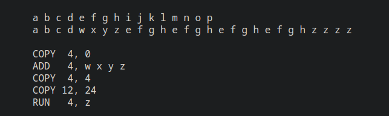

# Delta Encoding example

Project to create custom Delta Encoding. The idea is to create a video streaming with delta encoding.

# Encoding

## VCDIFF

 

## Configurations

### 1. "Byte rate"

The amount of change that can be sent in a request in bytes

# Communication

## TCP/UDP Socket

## USB (Optional)

# References

1. [Wikipedia](https://en.wikipedia.org/wiki/Delta_encoding)
2. [GoUSB](https://github.com/google/gousb)
3. [RFC3284 VCDIFF](https://datatracker.ietf.org/doc/html/rfc3284#section-3) and it's [article](https://www.cs.brandeis.edu/~dilant/cs175/%5BSiying-Dong%5D.pdf)
